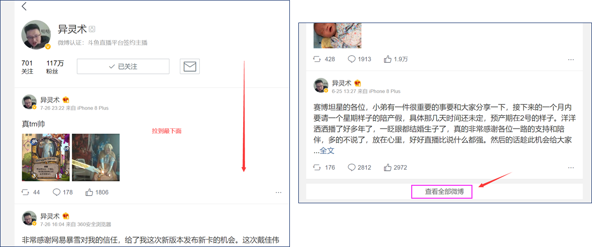
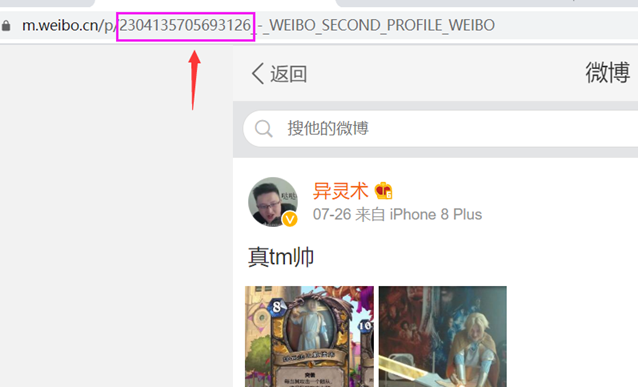

# 爬取个人全部微博

爬取某一个用户的全部微博，爬取站点 m.weibo.cn

此站点反爬很少比较好爬

主要思路就是访问api，其实也挺容易，就是构造的时候需要找到特定页面

在该页面下提取api，根据图中所示的id来构造api请求

其他的就是一些模拟登陆，ip防封等常规反爬手段，登陆主要是有时候要爬自己账号的微博含有那些只自己可见的内容，如果爬其他人这步可以省去，也可以就直接瞎填一个，不影响程序执行